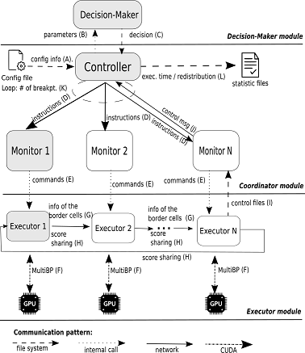

# MultiBP
MultiBP is a framework that allows the comaprison of long DNA sequences in multiple GPUs with pruning features using a score-sahre Static or Dynamic workload distribution.

# Source Code
It will be available soon.

# SLURM Scripts
The scripts to execute Static-MultiBP and Dynamic-MultiBP in a SLURM environment are availble here: https://github.com/Marcoacfbr/MultiBP/tree/main/Scripts

# Diagram

  

# References
It will be available soon.
